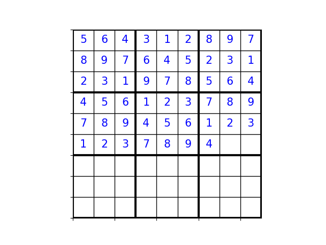
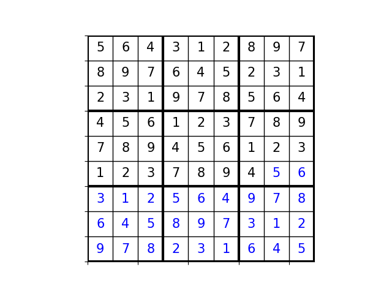

# Sudoku solving repository, exploring possible solutions via permutations and group theory.

This repository presents a small tool to visualize permutations of sudoku grids, find solutions (via backtracking), save and compare for research purposes etc.

## Permutations example usage
Assuming a valid sudoku input, a valid sudoku permutation is defined as a transformation that preserves the logical structure of the puzzle—meaning all Sudoku rules remain satisfied. Examples include swapping numbers, rows within a band, columns within a stack, or even rotating and reflecting the grid. 

A valid sudoku permutation is a bijective transformation $f : G -> G'$ of the sudoku grid G such that all Sudoku
constraints (sum of 45 digits accross rows, columns, blocks)
remain preserved. 

The main classes of the presented transformations are:

### Digit Permutation
Digit permutation replaces every digit $d_i \in {1, ...,9}$ with another unique 
digit $f(d_i)$. In other words, it is any permutation 
$pi \in S_9$ where $S_9$ denotes the set of digits. 
The grid remains valid after any of the 9! = 362880 possible permutations.

Use `switch_numbers(sudoku: list[list[str]],digits_to:list[int])`
to permutate given sudoku, assuming `digits_to` is a valid length 9 set of integers.

### Row Permutation within a Band

Assuming a band is the structure of the sudoku consisting
of 3 blocks in a row (or 1st, 2nd, 3rd row, etc), the row permutaiton
swaps two whole rows withing a band such that
the sudoku remains valid.

Use `switch_rows(sudoku: list[list[str]], row_1: int, row_2: int)`
to switch two rows. *Note that the permutation `grid, 3, 4` is compiled and returned
however the returned sudoku is no longer valid. Row parameters denote normal row numbering and not
python index numbering.*

### Column Permutation within a Stack

Assuming a stack is the structure of the sudoku consisting
of 3 blocks in a column (or 1st, 2nd, 3rd column, etc), the column permutation
swaps two whole columns withing a stack such that
the sudoku remains valid.

Use `sswitch_cols(sudoku: list[list[str]], col_1: int, col_2: int)`
to switch two columns. *Note that the permutation `grid, 3, 4` is compiled and returned
however the returned sudoku is no longer valid. Column parameters denote normal row numbering and not
python index numbering.*

### Transposition
Transposition of a (square) matrix simply reflects
the matrix over the main diagonal, 
mapping $(i, j) -> (j, i)$. Use
`transpose_matrix(sudoku: list[list[str | int]])`
to transpose the given sudoku.

### Rotations and Reflections
It is trivial that these symmetries preserve the
sudoku constraints. Use `rotate_matrix(list[list[str | int]])`
to rotate the matrix *clockwise* once. `reflect_horizontally()` and `reflect_vertically()`
implement the transformations respectively.

### Identity
The identity permutation simply returns the given matrix.
It seems that there is no point in this function,
however the notation is useful, because some permutations after other ones 
equal the identity (e.g. **rtrt=i**)
### Band permutation
to be added

### Stack permutation
to be added

## Main - Live visualization
Assuming a given sudoku `sudoku = 5643128978976452312319785644561237897894561231237894XXXXXXXXXXXXXXXXXXXXXXXXXXXXX`
wherether complete or not, we want to visualize it and run live permutations
to see the corresponding results. A sudoku can be represented by
either a string of 81 characters with `X` denoting 
an empty cell, or by a 9x9 list with 0 denoting
the empty cell.

Using `run_permutations(grid: str | list[list[int]], visualize: bool =True)`
we can use the above mentioned permutations on the grid (sudoku)
parameter and visualize them (if visualize = True). 
The function runs indefenitely until exited, where the 
final grid after permutations is returned.

More specifically, current permutations include: column switch "cs" , row switch "rs", reflect vertically "rv",\
             reflect horizontally "rh", clockwise rotation "r", transposition "t", and switching numbers\
              "ns". Press "i" to use the identity matrix. Press "exit" to exit, and "help" to see all commands.'
In current version, after choosing a permutation more data may be asked (e.g.
after choosing ns, a string of 9 numbers is asked.)

### Solution via backtracking

Given an incomplete sudoku as a string, we can run 
`solutions = []
grid = convert_to_matrix(sdk_valid)
backtrack(grid, 0, 0, solutions)
visualize_sdk(solutions[0], inital_grid=sdk_valid)`
to solve the sudoku and append all possible solutions in `solutinons` list.

Finally, 
`save_solutions_to_csv(solutions: list[list[list[int]]], unsolved: str) -> list[list[list[int]]] | None`
saves the solutions tensor to a csv file with the inital unsolved sudoku as the title.

Solved sudoku , black numbers represent intial unsolved grid.